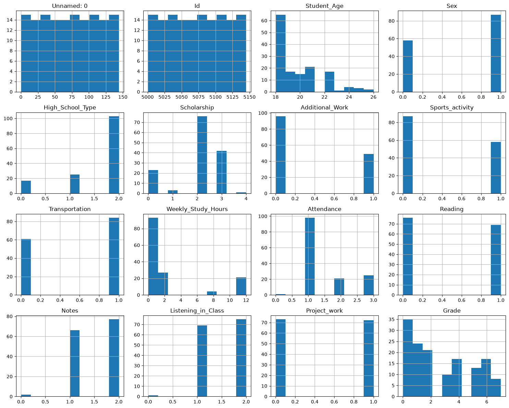

# Laporan UAS Kecerdasan Buatan

# Prediksi Nilai Akademik Mahasiswa Menggunakan Algoritma Decision Tree dan Random Forest

---

## Nama Kelompok

Nama : As'syifa Ramdani

NIM : 2406011

Program Studi : Teknik Informatika

Universitas : Institut Teknologi Garut

---

# 1. Pendahuluan

## 1.1 Judul Proyek

# Prediksi Nilai Akademik Mahasiswa Menggunakan Algoritma Decision Tree dan Random Forest

---

## 1.2 Latar Belakang

Perkembangan teknologi informasi telah membawa perubahan yang signifikan dalam berbagai bidang, termasuk bidang pendidikan. Salah satu teknologi yang berkembang pesat adalah **Artificial Intelligence (AI)**, khususnya **Machine Learning**, yang memungkinkan komputer mempelajari pola dari sekumpulan data untuk menghasilkan prediksi maupun klasifikasi tanpa diprogram secara eksplisit.

Dalam dunia pendidikan tinggi, prestasi akademik mahasiswa menjadi salah satu indikator utama dalam mengukur keberhasilan proses pembelajaran. Nilai akademik tidak hanya mencerminkan kemampuan intelektual mahasiswa, tetapi juga dipengaruhi oleh berbagai faktor lain seperti kebiasaan belajar, tingkat kehadiran, aktivitas membaca, kemampuan mencatat materi, perhatian saat perkuliahan, hingga keterlibatan dalam kegiatan akademik. Faktor-faktor tersebut saling berinteraksi dan membentuk pola yang dapat dianalisis menggunakan teknik Machine Learning.

Pada praktiknya, banyak perguruan tinggi baru mengetahui adanya penurunan prestasi mahasiswa setelah proses evaluasi akademik selesai dilakukan. Kondisi ini menyebabkan dosen maupun pihak program studi terlambat memberikan pendampingan akademik kepada mahasiswa yang membutuhkan. Padahal, apabila potensi penurunan prestasi dapat dideteksi lebih awal, institusi pendidikan dapat memberikan intervensi berupa bimbingan belajar, konseling akademik, maupun strategi pembelajaran yang lebih sesuai.

Machine Learning menawarkan solusi terhadap permasalahan tersebut melalui pembangunan model prediksi berdasarkan data historis mahasiswa. Dengan memanfaatkan data yang telah tersedia, model Machine Learning mampu mempelajari hubungan antarvariabel sehingga dapat memperkirakan kategori nilai akademik mahasiswa pada kondisi tertentu. Informasi hasil prediksi tersebut dapat digunakan sebagai dasar dalam pengambilan keputusan untuk meningkatkan kualitas proses pembelajaran.

Pada penelitian ini digunakan dua algoritma klasifikasi, yaitu **Decision Tree** dan **Random Forest**. Decision Tree dipilih karena memiliki struktur yang sederhana, mudah dipahami, serta mampu menghasilkan aturan keputusan yang dapat diinterpretasikan secara langsung. Sementara itu, Random Forest dipilih karena merupakan metode *ensemble learning* yang menggabungkan banyak pohon keputusan sehingga memiliki kemampuan generalisasi yang lebih baik dan cenderung menghasilkan performa yang lebih stabil dibandingkan Decision Tree tunggal.

Dataset yang digunakan merupakan **Student Performance Dataset** yang diperoleh dari platform Kaggle. Dataset ini berisi berbagai karakteristik mahasiswa, seperti usia, jenis kelamin, jenis sekolah asal, status beasiswa, jam belajar mingguan, kehadiran, aktivitas membaca, kebiasaan mencatat, tingkat perhatian saat perkuliahan, hingga partisipasi dalam proyek akademik. Seluruh atribut tersebut digunakan untuk memprediksi variabel target berupa **Grade** sebagai representasi nilai akademik mahasiswa.

Penelitian ini menerapkan metodologi **CRISP-DM (Cross Industry Standard Process for Data Mining)** yang terdiri atas enam tahapan, yaitu *Business Understanding*, *Data Understanding*, *Exploratory Data Analysis (EDA)*, *Data Preparation*, *Modeling*, dan *Evaluation*. Pendekatan ini dipilih karena memberikan alur kerja yang sistematis dalam pengembangan proyek Machine Learning sehingga hasil penelitian menjadi lebih terstruktur dan mudah direproduksi.

Melalui penelitian ini diharapkan dapat diperoleh model Machine Learning yang mampu membantu proses prediksi nilai akademik mahasiswa serta memberikan gambaran mengenai algoritma yang memiliki performa lebih baik berdasarkan hasil evaluasi menggunakan metrik **Accuracy**, **Precision**, **Recall**, dan **F1-Score**.

---

## 1.3 Rumusan Masalah

Berdasarkan latar belakang yang telah diuraikan, maka rumusan masalah dalam penelitian ini adalah sebagai berikut.

1. Bagaimana membangun model Machine Learning untuk memprediksi nilai akademik mahasiswa berdasarkan data karakteristik dan aktivitas belajar mahasiswa?

2. Bagaimana penerapan algoritma Decision Tree dalam melakukan klasifikasi nilai akademik mahasiswa?

3. Bagaimana penerapan algoritma Random Forest dalam melakukan klasifikasi nilai akademik mahasiswa?

4. Algoritma manakah yang memberikan performa terbaik berdasarkan hasil evaluasi menggunakan metrik Accuracy, Precision, Recall, dan F1-Score?

---

## 1.4 Tujuan Penelitian

Penelitian ini bertujuan untuk:

1. Membangun model Machine Learning untuk memprediksi nilai akademik mahasiswa menggunakan data historis mahasiswa.

2. Mengimplementasikan algoritma Decision Tree pada kasus prediksi nilai akademik mahasiswa.

3. Mengimplementasikan algoritma Random Forest pada kasus prediksi nilai akademik mahasiswa.

4. Membandingkan performa kedua algoritma berdasarkan hasil evaluasi model.

5. Menentukan algoritma terbaik yang dapat digunakan sebagai model prediksi nilai akademik mahasiswa.

---

## 1.5 Manfaat Penelitian

Hasil penelitian ini diharapkan memberikan manfaat bagi berbagai pihak, antara lain sebagai berikut.

### 1.5.1 Bagi Mahasiswa

Penelitian ini dapat membantu mahasiswa mengetahui faktor-faktor yang berpengaruh terhadap prestasi akademik sehingga dapat meningkatkan kualitas proses belajar dan mempersiapkan strategi belajar yang lebih efektif.

### 1.5.2 Bagi Dosen

Hasil prediksi yang dihasilkan model dapat digunakan sebagai informasi pendukung dalam mengidentifikasi mahasiswa yang memerlukan pendampingan akademik sehingga proses pembelajaran dapat dilakukan secara lebih tepat sasaran.

### 1.5.3 Bagi Program Studi

Model prediksi yang dibangun dapat menjadi salah satu dasar dalam proses pengambilan keputusan berbasis data (*data-driven decision making*) untuk meningkatkan kualitas akademik mahasiswa.

### 1.5.4 Bagi Peneliti Selanjutnya

Penelitian ini dapat dijadikan referensi dalam pengembangan model prediksi akademik menggunakan algoritma Machine Learning lainnya maupun dataset yang lebih besar.

---

## 1.6 Ruang Lingkup Penelitian

Agar penelitian lebih terarah, maka ruang lingkup penelitian dibatasi sebagai berikut.

1. Dataset yang digunakan merupakan **Student Performance Dataset** yang diperoleh dari platform Kaggle.

2. Penelitian hanya menggunakan atribut yang tersedia pada dataset tanpa menambahkan data dari sumber lain.

3. Variabel target penelitian adalah **Grade** yang merepresentasikan nilai akademik mahasiswa.

4. Algoritma Machine Learning yang digunakan hanya terdiri atas **Decision Tree** dan **Random Forest**.

5. Metodologi yang digunakan dalam penelitian adalah **CRISP-DM**.

6. Evaluasi model dilakukan menggunakan metrik **Accuracy**, **Precision**, **Recall**, **F1-Score**, serta **Confusion Matrix**.

7. Implementasi dilakukan menggunakan bahasa pemrograman Python dengan pustaka Pandas, NumPy, Matplotlib, Seaborn, dan Scikit-learn.

---

## 1.7 Sistematika Penulisan

Laporan ini disusun berdasarkan tahapan metodologi CRISP-DM yang terdiri atas beberapa bab sebagai berikut.

- **Bab 1 Pendahuluan**, berisi latar belakang, rumusan masalah, tujuan penelitian, manfaat penelitian, ruang lingkup penelitian, dan sistematika penulisan.

- **Bab 2 Business Understanding**, menjelaskan permasalahan bisnis, studi literatur, tujuan proyek, pengguna sistem, serta manfaat implementasi Artificial Intelligence.

- **Bab 3 Data Understanding**, membahas sumber dataset, karakteristik data, atribut yang digunakan, serta analisis awal terhadap dataset.

- **Bab 4 Exploratory Data Analysis (EDA)**, menyajikan visualisasi data, analisis distribusi data, analisis korelasi, serta temuan awal berdasarkan eksplorasi dataset.

- **Bab 5 Data Preparation**, menjelaskan proses pembersihan data, transformasi data, encoding, serta pembagian data latih dan data uji.

- **Bab 6 Modeling**, menjelaskan implementasi algoritma Decision Tree dan Random Forest beserta proses pelatihan model.

- **Bab 7 Evaluation**, membahas hasil evaluasi model menggunakan Accuracy, Precision, Recall, F1-Score, serta Confusion Matrix dan menentukan model terbaik.

- **Bab 8 Kesimpulan dan Saran**, berisi kesimpulan penelitian, keterbatasan penelitian, dan rekomendasi untuk penelitian selanjutnya.

# 2. Business Understanding

## 2.1 Gambaran Permasalahan

Perkembangan teknologi digital telah menghasilkan data dalam jumlah yang sangat besar, termasuk pada sektor pendidikan. Perguruan tinggi setiap semester mengumpulkan berbagai informasi mengenai mahasiswa, seperti data kehadiran, aktivitas belajar, kebiasaan membaca, partisipasi dalam kegiatan akademik, serta hasil evaluasi pembelajaran. Namun, pada banyak institusi pendidikan, data tersebut masih dimanfaatkan sebatas sebagai arsip administrasi dan belum digunakan secara optimal sebagai dasar pengambilan keputusan.

Salah satu permasalahan yang sering dihadapi adalah keterlambatan dalam mengidentifikasi mahasiswa yang mengalami penurunan prestasi akademik. Umumnya, dosen maupun program studi baru mengetahui adanya penurunan performa setelah nilai akhir mata kuliah diumumkan. Kondisi ini menyebabkan tindakan pendampingan akademik, seperti bimbingan belajar, konsultasi akademik, atau evaluasi metode pembelajaran, menjadi terlambat dilakukan.

Apabila potensi penurunan prestasi dapat diketahui lebih awal, institusi pendidikan dapat memberikan intervensi yang lebih tepat sasaran sehingga peluang mahasiswa untuk meningkatkan hasil belajarnya menjadi lebih besar. Oleh karena itu, diperlukan suatu pendekatan yang mampu menganalisis data akademik secara otomatis dan menghasilkan prediksi yang dapat digunakan sebagai pendukung pengambilan keputusan.

Machine Learning merupakan salah satu cabang Artificial Intelligence yang mampu mempelajari pola dari data historis untuk menghasilkan prediksi terhadap data baru. Dengan memanfaatkan data karakteristik mahasiswa dan aktivitas belajar, model Machine Learning dapat digunakan untuk memprediksi kategori nilai akademik mahasiswa sebelum proses evaluasi akhir selesai dilaksanakan.

---

## 2.2 Identifikasi Permasalahan

Berdasarkan kondisi tersebut, beberapa permasalahan yang menjadi fokus penelitian adalah sebagai berikut.

1. Belum adanya mekanisme prediksi dini terhadap performa akademik mahasiswa berdasarkan data aktivitas belajar.

2. Pemanfaatan data akademik masih terbatas pada proses dokumentasi sehingga belum digunakan secara maksimal sebagai dasar pengambilan keputusan.

3. Belum diketahui algoritma Machine Learning yang memberikan performa lebih baik dalam melakukan prediksi nilai akademik mahasiswa pada dataset yang digunakan.

4. Diperlukan model klasifikasi yang mampu membantu institusi pendidikan mengidentifikasi mahasiswa yang berpotensi mengalami penurunan prestasi akademik.

---

## 2.3 Tujuan Bisnis

Secara umum, penelitian ini bertujuan untuk mendukung proses pengambilan keputusan pada bidang pendidikan melalui pemanfaatan Artificial Intelligence.

Secara khusus, tujuan penelitian ini adalah sebagai berikut.

1. Membangun model Machine Learning yang mampu memprediksi nilai akademik mahasiswa berdasarkan karakteristik dan aktivitas belajar mahasiswa.

2. Membandingkan performa algoritma Decision Tree dan Random Forest dalam melakukan klasifikasi nilai akademik.

3. Menentukan algoritma yang memiliki performa terbaik berdasarkan hasil evaluasi model.

4. Memberikan informasi yang dapat digunakan sebagai bahan pertimbangan bagi dosen maupun program studi dalam melakukan pendampingan akademik secara lebih dini.

---

## 2.4 Manfaat Bisnis

Implementasi model prediksi nilai akademik diharapkan memberikan manfaat bagi berbagai pihak.

### a. Bagi Mahasiswa

Mahasiswa dapat memperoleh gambaran mengenai faktor-faktor yang memengaruhi prestasi akademiknya sehingga dapat memperbaiki kebiasaan belajar sejak dini.

### b. Bagi Dosen

Dosen dapat menggunakan hasil prediksi sebagai informasi tambahan untuk mengidentifikasi mahasiswa yang membutuhkan perhatian atau pendampingan akademik sebelum nilai akhir diperoleh.

### c. Bagi Program Studi

Program studi dapat memanfaatkan hasil prediksi sebagai salah satu dasar dalam menyusun strategi peningkatan kualitas pembelajaran dan layanan akademik.

### d. Bagi Institusi Pendidikan

Institusi pendidikan dapat mengembangkan sistem pendukung keputusan (*Decision Support System*) berbasis Artificial Intelligence yang memanfaatkan data akademik sebagai dasar evaluasi dan perencanaan.

---

## 2.5 Literature Review

Penelitian mengenai prediksi prestasi akademik mahasiswa telah banyak dilakukan menggunakan berbagai algoritma Machine Learning.

Hidayat et al. (2025) membandingkan algoritma Decision Tree dan Random Forest dalam memprediksi performa akademik mahasiswa berdasarkan aktivitas pembelajaran. Hasil penelitian menunjukkan bahwa Random Forest memberikan performa yang lebih baik dibandingkan Decision Tree karena mampu mengurangi risiko overfitting melalui pendekatan *ensemble learning*.

Gusnina et al. (2022) menerapkan algoritma Random Forest untuk memprediksi performa akademik mahasiswa di Universitas Sebelas Maret. Penelitian tersebut menunjukkan bahwa Random Forest memiliki tingkat akurasi yang baik dalam mengolah data akademik mahasiswa dan dapat digunakan sebagai pendukung pengambilan keputusan.

Gotardo (2019) menunjukkan bahwa Decision Tree memiliki keunggulan dari sisi interpretasi model karena mampu menghasilkan aturan keputusan (*decision rules*) yang mudah dipahami oleh pengguna, meskipun performanya dapat dipengaruhi oleh karakteristik dataset yang digunakan.

Aman et al. (2025) mengimplementasikan beberapa algoritma Machine Learning untuk memprediksi nilai akademik mahasiswa dan menyimpulkan bahwa pemilihan algoritma sangat dipengaruhi oleh kualitas data, jumlah atribut, serta distribusi kelas pada dataset.

Simaremare et al. (2023) memanfaatkan data psikologis mahasiswa sebagai atribut tambahan dalam proses prediksi prestasi akademik menggunakan Machine Learning. Penelitian tersebut menunjukkan bahwa penambahan atribut yang relevan dapat meningkatkan kemampuan model dalam melakukan klasifikasi.

Berdasarkan beberapa penelitian terdahulu tersebut, dapat disimpulkan bahwa algoritma Decision Tree dan Random Forest merupakan metode yang layak digunakan pada penelitian ini karena keduanya telah banyak diterapkan dalam kasus prediksi performa akademik mahasiswa.

---

## 2.6 Solusi yang Diusulkan

Solusi yang diusulkan dalam penelitian ini adalah membangun model klasifikasi menggunakan algoritma Decision Tree dan Random Forest untuk memprediksi nilai akademik mahasiswa.

Proses pengembangan model dilakukan menggunakan metodologi **CRISP-DM**, yang terdiri atas enam tahapan, yaitu:

1. Business Understanding
2. Data Understanding
3. Exploratory Data Analysis (EDA)
4. Data Preparation
5. Modeling
6. Evaluation

Melalui tahapan tersebut diharapkan diperoleh model Machine Learning yang mampu mempelajari pola dari data historis mahasiswa dan menghasilkan prediksi nilai akademik pada data baru.

---

## 2.7 Pengguna Sistem

Model prediksi yang dihasilkan pada penelitian ini dapat dimanfaatkan oleh beberapa pihak sebagai berikut.

| Pengguna | Manfaat |
|----------|---------|
| Mahasiswa | Mengetahui faktor yang memengaruhi prestasi akademik sehingga dapat meningkatkan strategi belajar. |
| Dosen | Mengidentifikasi mahasiswa yang memerlukan pendampingan akademik lebih awal. |
| Program Studi | Mendukung proses evaluasi dan pengambilan keputusan berbasis data. |
| Institusi Pendidikan | Sebagai dasar pengembangan sistem prediksi akademik berbasis Artificial Intelligence. |

---

## 2.8 Kriteria Keberhasilan (Success Criteria)

Penelitian ini dinyatakan berhasil apabila memenuhi beberapa kriteria berikut.

1. Dataset berhasil diproses hingga siap digunakan dalam pemodelan Machine Learning.

2. Model Decision Tree dan Random Forest berhasil dibangun menggunakan pustaka Scikit-learn.

3. Model mampu melakukan prediksi terhadap data uji tanpa mengalami kesalahan (*error*).

4. Hasil evaluasi dapat diperoleh menggunakan metrik Accuracy, Precision, Recall, F1-Score, serta Confusion Matrix.

5. Diperoleh perbandingan performa antara Decision Tree dan Random Forest sehingga dapat ditentukan algoritma dengan performa terbaik pada dataset yang digunakan.

---

## 2.9 Dampak Implementasi Artificial Intelligence

Penerapan Artificial Intelligence pada penelitian ini diharapkan memberikan kontribusi dalam meningkatkan kualitas layanan pendidikan melalui pemanfaatan data akademik secara lebih efektif.

Model prediksi yang dihasilkan dapat membantu proses identifikasi dini terhadap mahasiswa yang berpotensi mengalami penurunan prestasi akademik sehingga institusi pendidikan dapat melakukan tindakan preventif sebelum proses evaluasi akademik berakhir.

Selain itu, penelitian ini menunjukkan bahwa Machine Learning dapat diterapkan sebagai salah satu teknologi pendukung dalam pengambilan keputusan berbasis data (*data-driven decision making*) pada lingkungan pendidikan tinggi.

# 2. Business Understanding

## 2.1 Gambaran Permasalahan

Perkembangan teknologi digital telah menghasilkan data dalam jumlah yang sangat besar, termasuk pada sektor pendidikan. Perguruan tinggi setiap semester mengumpulkan berbagai informasi mengenai mahasiswa, seperti data kehadiran, aktivitas belajar, kebiasaan membaca, partisipasi dalam kegiatan akademik, serta hasil evaluasi pembelajaran. Namun, pada banyak institusi pendidikan, data tersebut masih dimanfaatkan sebatas sebagai arsip administrasi dan belum digunakan secara optimal sebagai dasar pengambilan keputusan.

Salah satu permasalahan yang sering dihadapi adalah keterlambatan dalam mengidentifikasi mahasiswa yang mengalami penurunan prestasi akademik. Umumnya, dosen maupun program studi baru mengetahui adanya penurunan performa setelah nilai akhir mata kuliah diumumkan. Kondisi ini menyebabkan tindakan pendampingan akademik, seperti bimbingan belajar, konsultasi akademik, atau evaluasi metode pembelajaran, menjadi terlambat dilakukan.

Apabila potensi penurunan prestasi dapat diketahui lebih awal, institusi pendidikan dapat memberikan intervensi yang lebih tepat sasaran sehingga peluang mahasiswa untuk meningkatkan hasil belajarnya menjadi lebih besar. Oleh karena itu, diperlukan suatu pendekatan yang mampu menganalisis data akademik secara otomatis dan menghasilkan prediksi yang dapat digunakan sebagai pendukung pengambilan keputusan.

Machine Learning merupakan salah satu cabang Artificial Intelligence yang mampu mempelajari pola dari data historis untuk menghasilkan prediksi terhadap data baru. Dengan memanfaatkan data karakteristik mahasiswa dan aktivitas belajar, model Machine Learning dapat digunakan untuk memprediksi kategori nilai akademik mahasiswa sebelum proses evaluasi akhir selesai dilaksanakan.

---

## 2.2 Identifikasi Permasalahan

Berdasarkan kondisi tersebut, beberapa permasalahan yang menjadi fokus penelitian adalah sebagai berikut.

1. Belum adanya mekanisme prediksi dini terhadap performa akademik mahasiswa berdasarkan data aktivitas belajar.

2. Pemanfaatan data akademik masih terbatas pada proses dokumentasi sehingga belum digunakan secara maksimal sebagai dasar pengambilan keputusan.

3. Belum diketahui algoritma Machine Learning yang memberikan performa lebih baik dalam melakukan prediksi nilai akademik mahasiswa pada dataset yang digunakan.

4. Diperlukan model klasifikasi yang mampu membantu institusi pendidikan mengidentifikasi mahasiswa yang berpotensi mengalami penurunan prestasi akademik.

---

## 2.3 Tujuan Bisnis

Secara umum, penelitian ini bertujuan untuk mendukung proses pengambilan keputusan pada bidang pendidikan melalui pemanfaatan Artificial Intelligence.

Secara khusus, tujuan penelitian ini adalah sebagai berikut.

1. Membangun model Machine Learning yang mampu memprediksi nilai akademik mahasiswa berdasarkan karakteristik dan aktivitas belajar mahasiswa.

2. Membandingkan performa algoritma Decision Tree dan Random Forest dalam melakukan klasifikasi nilai akademik.

3. Menentukan algoritma yang memiliki performa terbaik berdasarkan hasil evaluasi model.

4. Memberikan informasi yang dapat digunakan sebagai bahan pertimbangan bagi dosen maupun program studi dalam melakukan pendampingan akademik secara lebih dini.

---

## 2.4 Manfaat Bisnis

Implementasi model prediksi nilai akademik diharapkan memberikan manfaat bagi berbagai pihak.

### a. Bagi Mahasiswa

Mahasiswa dapat memperoleh gambaran mengenai faktor-faktor yang memengaruhi prestasi akademiknya sehingga dapat memperbaiki kebiasaan belajar sejak dini.

### b. Bagi Dosen

Dosen dapat menggunakan hasil prediksi sebagai informasi tambahan untuk mengidentifikasi mahasiswa yang membutuhkan perhatian atau pendampingan akademik sebelum nilai akhir diperoleh.

### c. Bagi Program Studi

Program studi dapat memanfaatkan hasil prediksi sebagai salah satu dasar dalam menyusun strategi peningkatan kualitas pembelajaran dan layanan akademik.

### d. Bagi Institusi Pendidikan

Institusi pendidikan dapat mengembangkan sistem pendukung keputusan (*Decision Support System*) berbasis Artificial Intelligence yang memanfaatkan data akademik sebagai dasar evaluasi dan perencanaan.

---

## 2.5 Literature Review

Penelitian mengenai prediksi prestasi akademik mahasiswa telah banyak dilakukan menggunakan berbagai algoritma Machine Learning.

Hidayat et al. (2025) membandingkan algoritma Decision Tree dan Random Forest dalam memprediksi performa akademik mahasiswa berdasarkan aktivitas pembelajaran. Hasil penelitian menunjukkan bahwa Random Forest memberikan performa yang lebih baik dibandingkan Decision Tree karena mampu mengurangi risiko overfitting melalui pendekatan *ensemble learning*.

Gusnina et al. (2022) menerapkan algoritma Random Forest untuk memprediksi performa akademik mahasiswa di Universitas Sebelas Maret. Penelitian tersebut menunjukkan bahwa Random Forest memiliki tingkat akurasi yang baik dalam mengolah data akademik mahasiswa dan dapat digunakan sebagai pendukung pengambilan keputusan.

Gotardo (2019) menunjukkan bahwa Decision Tree memiliki keunggulan dari sisi interpretasi model karena mampu menghasilkan aturan keputusan (*decision rules*) yang mudah dipahami oleh pengguna, meskipun performanya dapat dipengaruhi oleh karakteristik dataset yang digunakan.

Aman et al. (2025) mengimplementasikan beberapa algoritma Machine Learning untuk memprediksi nilai akademik mahasiswa dan menyimpulkan bahwa pemilihan algoritma sangat dipengaruhi oleh kualitas data, jumlah atribut, serta distribusi kelas pada dataset.

Simaremare et al. (2023) memanfaatkan data psikologis mahasiswa sebagai atribut tambahan dalam proses prediksi prestasi akademik menggunakan Machine Learning. Penelitian tersebut menunjukkan bahwa penambahan atribut yang relevan dapat meningkatkan kemampuan model dalam melakukan klasifikasi.

Berdasarkan beberapa penelitian terdahulu tersebut, dapat disimpulkan bahwa algoritma Decision Tree dan Random Forest merupakan metode yang layak digunakan pada penelitian ini karena keduanya telah banyak diterapkan dalam kasus prediksi performa akademik mahasiswa.

---

## 2.6 Solusi yang Diusulkan

Solusi yang diusulkan dalam penelitian ini adalah membangun model klasifikasi menggunakan algoritma Decision Tree dan Random Forest untuk memprediksi nilai akademik mahasiswa.

Proses pengembangan model dilakukan menggunakan metodologi **CRISP-DM**, yang terdiri atas enam tahapan, yaitu:

1. Business Understanding
2. Data Understanding
3. Exploratory Data Analysis (EDA)
4. Data Preparation
5. Modeling
6. Evaluation

Melalui tahapan tersebut diharapkan diperoleh model Machine Learning yang mampu mempelajari pola dari data historis mahasiswa dan menghasilkan prediksi nilai akademik pada data baru.

---

## 2.7 Pengguna Sistem

Model prediksi yang dihasilkan pada penelitian ini dapat dimanfaatkan oleh beberapa pihak sebagai berikut.

| Pengguna | Manfaat |
|----------|---------|
| Mahasiswa | Mengetahui faktor yang memengaruhi prestasi akademik sehingga dapat meningkatkan strategi belajar. |
| Dosen | Mengidentifikasi mahasiswa yang memerlukan pendampingan akademik lebih awal. |
| Program Studi | Mendukung proses evaluasi dan pengambilan keputusan berbasis data. |
| Institusi Pendidikan | Sebagai dasar pengembangan sistem prediksi akademik berbasis Artificial Intelligence. |

---

## 2.8 Kriteria Keberhasilan (Success Criteria)

Penelitian ini dinyatakan berhasil apabila memenuhi beberapa kriteria berikut.

1. Dataset berhasil diproses hingga siap digunakan dalam pemodelan Machine Learning.

2. Model Decision Tree dan Random Forest berhasil dibangun menggunakan pustaka Scikit-learn.

3. Model mampu melakukan prediksi terhadap data uji tanpa mengalami kesalahan (*error*).

4. Hasil evaluasi dapat diperoleh menggunakan metrik Accuracy, Precision, Recall, F1-Score, serta Confusion Matrix.

5. Diperoleh perbandingan performa antara Decision Tree dan Random Forest sehingga dapat ditentukan algoritma dengan performa terbaik pada dataset yang digunakan.

---

## 2.9 Dampak Implementasi Artificial Intelligence

Penerapan Artificial Intelligence pada penelitian ini diharapkan memberikan kontribusi dalam meningkatkan kualitas layanan pendidikan melalui pemanfaatan data akademik secara lebih efektif.

Model prediksi yang dihasilkan dapat membantu proses identifikasi dini terhadap mahasiswa yang berpotensi mengalami penurunan prestasi akademik sehingga institusi pendidikan dapat melakukan tindakan preventif sebelum proses evaluasi akademik berakhir.

Selain itu, penelitian ini menunjukkan bahwa Machine Learning dapat diterapkan sebagai salah satu teknologi pendukung dalam pengambilan keputusan berbasis data (*data-driven decision making*) pada lingkungan pendidikan tinggi.

# 3. Data Understanding

## 3.1 Sumber Dataset

Tahap **Data Understanding** merupakan tahap kedua dalam metodologi **CRISP-DM** yang bertujuan untuk memahami karakteristik dataset sebelum dilakukan proses pengolahan dan pemodelan Machine Learning. Pada tahap ini dilakukan identifikasi terhadap sumber data, struktur data, tipe data, atribut yang digunakan, serta pemeriksaan kualitas data secara umum.

Dataset yang digunakan dalam penelitian ini diperoleh dari platform **Kaggle** dengan nama **Student Performance Dataset**. Dataset tersebut berisi informasi mengenai karakteristik mahasiswa, aktivitas belajar, serta faktor-faktor yang diduga memengaruhi prestasi akademik mahasiswa.

Dataset dipilih karena memiliki atribut yang relevan dengan tujuan penelitian, yaitu membangun model klasifikasi untuk memprediksi nilai akademik mahasiswa berdasarkan berbagai faktor yang berkaitan dengan proses pembelajaran.

---

## 3.2 Deskripsi Dataset

Dataset yang digunakan memiliki karakteristik sebagai berikut.

| Informasi | Keterangan |
|-----------|------------|
| Nama Dataset | Student Performance Dataset |
| Sumber | Kaggle |
| Format File | CSV |
| Jumlah Data | 145 baris |
| Jumlah Atribut | 16 atribut |
| Variabel Target | Grade |
| Jenis Permasalahan | Multiclass Classification |

Dataset terdiri atas lima belas atribut sebagai variabel prediktor (*feature*) dan satu atribut sebagai variabel target (*label*), yaitu **Grade**. Setiap baris merepresentasikan satu data mahasiswa dengan karakteristik yang berbeda-beda.

---

## 3.3 Struktur Dataset

Berdasarkan hasil pembacaan dataset menggunakan library **Pandas**, diperoleh ukuran dataset sebagai berikut.

```python
print(data.shape)
```

Output:

```
(145, 16)
```

Artinya dataset terdiri atas:

- **145 baris (records)**
- **16 kolom (attributes)**

Setiap baris merepresentasikan satu mahasiswa, sedangkan setiap kolom berisi informasi mengenai karakteristik mahasiswa maupun aktivitas pembelajarannya.

---

## 3.4 Deskripsi Setiap Atribut

Berikut merupakan penjelasan setiap atribut yang digunakan dalam penelitian.

| No | Nama Atribut | Deskripsi |
|----|--------------|-----------|
| 1 | Student Age | Usia mahasiswa |
| 2 | Sex | Jenis kelamin mahasiswa |
| 3 | High School Type | Jenis sekolah asal mahasiswa |
| 4 | Scholarship | Status penerima beasiswa |
| 5 | Additional Work | Status pekerjaan sampingan |
| 6 | Regular Artistic/Sports Activity | Keikutsertaan dalam kegiatan seni atau olahraga |
| 7 | Do You Have a Partner? | Status memiliki pasangan |
| 8 | Total Salary | Pendapatan bulanan mahasiswa |
| 9 | Transportation | Moda transportasi menuju kampus |
| 10 | Weekly Study Hours | Rata-rata jam belajar setiap minggu |
| 11 | Attendance | Tingkat kehadiran mahasiswa |
| 12 | Reading | Frekuensi aktivitas membaca |
| 13 | Notes | Kebiasaan membuat catatan saat belajar |
| 14 | Listening in Class | Tingkat perhatian saat perkuliahan |
| 15 | Project Work | Partisipasi dalam pengerjaan proyek akademik |
| 16 | Grade | Nilai akademik mahasiswa (target klasifikasi) |

Seluruh atribut selain **Grade** digunakan sebagai variabel independen (*feature*) untuk membangun model prediksi.

---

## 3.5 Identifikasi Variabel

Pada penelitian ini, atribut dibagi menjadi dua kelompok, yaitu variabel independen (*feature*) dan variabel dependen (*target*).

### Feature (X)

Feature merupakan atribut yang digunakan sebagai masukan (*input*) dalam proses pembelajaran model Machine Learning.

Feature yang digunakan meliputi:

- Student Age
- Sex
- High School Type
- Scholarship
- Additional Work
- Regular Artistic/Sports Activity
- Do You Have a Partner?
- Total Salary
- Transportation
- Weekly Study Hours
- Attendance
- Reading
- Notes
- Listening in Class
- Project Work

### Target (y)

Variabel target pada penelitian ini adalah:

```
Grade
```

Atribut tersebut merepresentasikan kategori nilai akademik mahasiswa yang akan diprediksi menggunakan algoritma Machine Learning.

---

## 3.6 Pemeriksaan Tipe Data

Pemeriksaan tipe data dilakukan menggunakan fungsi berikut.

```python
data.info()
```

Hasil pemeriksaan menunjukkan bahwa dataset terdiri atas kombinasi atribut numerik dan kategorikal. Oleh karena itu, sebelum proses pemodelan dilakukan, atribut kategorikal perlu diubah ke dalam bentuk numerik melalui proses **Label Encoding**. Tahapan tersebut akan dijelaskan lebih rinci pada Bab 5 (Data Preparation).

---

## 3.7 Pemeriksaan Missing Value

Salah satu langkah penting pada tahap Data Understanding adalah mengidentifikasi keberadaan nilai kosong (*missing value*).

Pemeriksaan dilakukan menggunakan kode berikut.

```python
data.isnull().sum()
```

Hasil pemeriksaan menunjukkan jumlah nilai kosong pada setiap atribut.

Apabila ditemukan missing value, maka akan dilakukan proses penanganan pada tahap **Data Preparation**. Jika tidak ditemukan nilai kosong, dataset dapat langsung digunakan pada proses berikutnya.

---

## 3.8 Pemeriksaan Data Duplikat

Selain missing value, dilakukan pula pemeriksaan terhadap kemungkinan adanya data yang duplikat menggunakan kode berikut.

```python
data.duplicated().sum()
```

Pemeriksaan ini bertujuan untuk memastikan bahwa setiap baris data merepresentasikan satu observasi yang unik sehingga tidak menimbulkan bias selama proses pelatihan model.

Jika ditemukan data duplikat, maka data tersebut akan dihapus pada tahap Data Preparation.

---


# 4. Exploratory Data Analysis (EDA)

## 4.1 Visualisasi Distribusi Data

Masukkan gambar:

- Distribusi Grade
- Distribusi Study Hours
- Distribusi Attendance

### Gambar Visualisasi


```python
plt.figure(figsize=(8,5))
sns.countplot(
    data=df,
    x="Grade",
    order=sorted(df["Grade"].unique())
)

plt.title("Distribusi Nilai Akademik Mahasiswa")
plt.xlabel("Grade")
plt.ylabel("Jumlah Mahasiswa")
plt.savefig("data/distribusi_nilai_akademik_mahasiswa.png", bbox_inches="tight")
plt.show()
```

---

## 4.2 Analisis Korelasi

Masukkan Heatmap.

### Gambar Korelasi


Jelaskan:

- Feature yang memiliki korelasi tinggi.
- Feature yang memiliki korelasi rendah.

```python
plt.figure(figsize=(12,8))
sns.heatmap(
    eda_df.corr(),
    annot=True,
    cmap="coolwarm",
    fmt=".2f"
)

plt.title("Heatmap Korelasi Antar Variabel")
plt.savefig("data/heatmap_korelasi_antar_variabel.png", bbox_inches="tight")
plt.show()
```

---

## 4.3 Deteksi Ketidakseimbangan Data

Tampilkan grafik distribusi Grade.

### Gambar Deteksi Ketidakseimbangan




Jelaskan apakah dataset mengalami class imbalance atau tidak.

---

## 4.4 Insight Awal

Tuliskan hasil temuan, misalnya:

- Kehadiran memiliki hubungan positif terhadap Grade.
- Jam belajar berpengaruh terhadap nilai.
- Sebagian besar mahasiswa memperoleh Grade tertentu.

---

# 5. Data Preparation

## 5.1 Pendahuluan

Data Preparation merupakan tahapan keempat dalam metodologi **CRISP-DM** yang bertujuan untuk mempersiapkan dataset agar siap digunakan pada proses pemodelan Machine Learning. Tahapan ini sangat penting karena kualitas data yang digunakan akan memengaruhi performa model yang dihasilkan.

Pada penelitian ini dilakukan beberapa proses persiapan data, meliputi pemeriksaan kualitas data, penghapusan atribut yang tidak diperlukan, transformasi data kategorikal menjadi numerik menggunakan **Label Encoding**, serta pembagian dataset menjadi data latih (*training set*) dan data uji (*testing set*).

Tahapan Data Preparation dilakukan menggunakan library **Pandas** dan **Scikit-learn**.

---

# 5.2 Data Cleaning

Data cleaning merupakan proses awal untuk memastikan bahwa dataset berada dalam kondisi yang baik sebelum digunakan pada proses pelatihan model.

Tahapan yang dilakukan meliputi:

1. Menghapus atribut yang tidak memiliki pengaruh terhadap proses klasifikasi.
2. Memastikan tidak terdapat nilai kosong (*missing value*).
3. Memastikan tidak terdapat data yang duplikat.
4. Memastikan seluruh atribut memiliki format yang sesuai.

Pada dataset ini ditemukan beberapa atribut yang tidak digunakan dalam proses pemodelan, yaitu:

- **Unnamed: 0**
- **Id**

Kedua atribut tersebut hanya berfungsi sebagai indeks atau identitas data sehingga tidak memberikan informasi yang berkaitan dengan prediksi nilai akademik mahasiswa. Oleh karena itu, atribut tersebut dihapus dari dataset.

### Implementasi

```python
drop_columns = ["Unnamed: 0", "Id"]

data.drop(columns=drop_columns, inplace=True)

data.head()
```

Setelah proses penghapusan dilakukan, dataset hanya berisi atribut yang relevan terhadap proses klasifikasi.

---

# 5.3 Pemeriksaan Missing Value

Sebelum membangun model Machine Learning, dilakukan pemeriksaan terhadap kemungkinan adanya nilai kosong (*missing value*) pada dataset.

Missing value dapat menyebabkan proses pelatihan model menjadi tidak optimal bahkan menghasilkan kesalahan (*error*) apabila tidak ditangani dengan baik.

Pemeriksaan dilakukan menggunakan fungsi berikut.

```python
data.isnull().sum()
```

### Hasil Pemeriksaan

Hasil pemeriksaan menunjukkan bahwa seluruh atribut pada dataset **tidak memiliki missing value**, sehingga tidak diperlukan proses imputasi maupun penghapusan data.

Dengan demikian, dataset dapat langsung digunakan pada tahap berikutnya.

---

# 5.4 Pemeriksaan Data Duplikat

Selain missing value, dilakukan pula pemeriksaan terhadap kemungkinan adanya data yang duplikat.

Data duplikat dapat menyebabkan model memberikan bobot yang lebih besar pada observasi tertentu sehingga hasil prediksi menjadi kurang representatif.

Pemeriksaan dilakukan menggunakan kode berikut.

```python
data.duplicated().sum()
```

### Hasil Pemeriksaan

Berdasarkan hasil pemeriksaan, dataset **tidak memiliki data yang duplikat**, sehingga seluruh data dapat digunakan pada proses pemodelan.

---

# 5.5 Transformasi Data (Label Encoding)

Sebagian atribut pada dataset memiliki tipe data kategorikal (*categorical data*), sedangkan algoritma Decision Tree dan Random Forest hanya dapat memproses data numerik.

Oleh karena itu, seluruh atribut kategorikal diubah menjadi representasi numerik menggunakan metode **Label Encoding**.

Label Encoding bekerja dengan memberikan kode bilangan bulat pada setiap kategori yang terdapat pada suatu atribut.

Sebagai contoh:

| Kategori | Hasil Encoding |
|----------|---------------:|
| Female | 0 |
| Male | 1 |

Perlu diperhatikan bahwa nilai numerik hasil Label Encoding tidak menunjukkan urutan maupun tingkat kepentingan, melainkan hanya sebagai representasi kategori agar dapat diproses oleh algoritma Machine Learning.

### Implementasi

```python
from sklearn.preprocessing import LabelEncoder
from pandas.api.types import is_string_dtype

label_encoder = LabelEncoder()

for column in data.columns:
    if is_string_dtype(data[column]):
        data[column] = label_encoder.fit_transform(data[column])

data.head()
```

Setelah proses encoding selesai dilakukan, seluruh atribut pada dataset telah memiliki tipe data numerik sehingga siap digunakan pada proses pelatihan model.

---

# 5.6 Pemisahan Feature dan Target

Tahap berikutnya adalah memisahkan variabel independen (*feature*) dan variabel dependen (*target*).

Pada penelitian ini, atribut **Grade** digunakan sebagai variabel target, sedangkan seluruh atribut lainnya digunakan sebagai feature.

### Implementasi

```python
X = data.drop("Grade", axis=1)

y = data["Grade"]
```

Keterangan:

- **X** berisi seluruh atribut yang digunakan sebagai masukan (*input*) model.
- **y** berisi label atau target yang akan diprediksi oleh model Machine Learning.

---

# 5.7 Normalisasi Data

Normalisasi merupakan proses penyamaan skala antar atribut agar memiliki rentang nilai yang seragam.

Namun, pada penelitian ini **normalisasi tidak dilakukan** karena algoritma yang digunakan, yaitu **Decision Tree** dan **Random Forest**, merupakan algoritma berbasis pohon keputusan (*tree-based algorithms*).

Kedua algoritma tersebut melakukan proses pemisahan data berdasarkan nilai ambang (*threshold splitting*) dan tidak menggunakan perhitungan jarak (*distance-based calculation*). Oleh karena itu, perubahan skala data tidak memberikan pengaruh yang signifikan terhadap proses pembentukan model.

Dengan demikian, dataset dapat langsung digunakan tanpa proses normalisasi.

---

# 5.8 Pembagian Data Latih dan Data Uji

Setelah seluruh data siap digunakan, dilakukan proses pembagian dataset menjadi data latih (*training set*) dan data uji (*testing set*).

Pembagian data dilakukan menggunakan fungsi **train_test_split()** dari Scikit-learn dengan komposisi:

- **80%** data latih
- **20%** data uji

Parameter **random_state = 42** digunakan agar hasil pembagian data dapat direproduksi, sedangkan parameter **stratify = y** digunakan untuk menjaga proporsi setiap kelas pada data latih dan data uji tetap seimbang.

### Implementasi

```python
from sklearn.model_selection import train_test_split

X_train, X_test, y_train, y_test = train_test_split(
    X,
    y,
    test_size=0.2,
    random_state=42,
    stratify=y
)

print("Data Latih :", X_train.shape)
print("Data Uji :", X_test.shape)
```

### Hasil Pembagian Dataset

| Dataset | Persentase |
|----------|-----------:|
| Data Latih | 80% |
| Data Uji | 20% |

Data latih digunakan untuk membangun model Machine Learning, sedangkan data uji digunakan untuk mengevaluasi kemampuan model dalam melakukan prediksi terhadap data yang belum pernah dilihat sebelumnya.

---


# 6. Modeling

## 6.1 Pendahuluan

Modeling merupakan tahapan kelima dalam metodologi **CRISP-DM** yang bertujuan untuk membangun model Machine Learning berdasarkan dataset yang telah dipersiapkan pada tahap sebelumnya. Pada penelitian ini digunakan dua algoritma klasifikasi, yaitu **Decision Tree** dan **Random Forest**, untuk memprediksi nilai akademik mahasiswa berdasarkan karakteristik dan aktivitas belajar.

Pemilihan kedua algoritma tersebut didasarkan pada beberapa pertimbangan. Decision Tree dipilih karena memiliki struktur yang sederhana, mudah dipahami, serta mampu menghasilkan aturan keputusan yang dapat diinterpretasikan secara langsung. Sementara itu, Random Forest dipilih karena merupakan metode *ensemble learning* yang mampu meningkatkan performa klasifikasi dengan menggabungkan banyak pohon keputusan sehingga lebih tahan terhadap overfitting.

Seluruh proses pemodelan dilakukan menggunakan library **Scikit-learn** pada bahasa pemrograman Python.

---

# 6.2 Algoritma Decision Tree

## 6.2.1 Konsep Decision Tree

Decision Tree merupakan algoritma Machine Learning berbasis pohon keputusan (*tree-based algorithm*) yang bekerja dengan membagi data ke dalam beberapa cabang berdasarkan atribut yang dianggap paling mampu memisahkan kelas.

Setiap simpul (*node*) pada pohon merepresentasikan suatu atribut, sedangkan setiap cabang menunjukkan hasil keputusan berdasarkan nilai atribut tersebut. Proses pembentukan pohon dilakukan secara berulang hingga diperoleh daun (*leaf node*) yang merepresentasikan kelas target.

Keunggulan utama Decision Tree adalah kemampuannya menghasilkan aturan keputusan yang mudah dipahami oleh manusia sehingga sering digunakan pada kasus klasifikasi yang memerlukan interpretasi model.

---

## 6.2.2 Alasan Pemilihan Decision Tree

Algoritma Decision Tree dipilih karena memiliki beberapa keunggulan, yaitu:

1. Mudah dipahami dan diinterpretasikan.
2. Tidak memerlukan proses normalisasi data.
3. Mampu menangani data kategorikal maupun numerik.
4. Proses pelatihan relatif cepat.
5. Dapat divisualisasikan dalam bentuk struktur pohon keputusan.

Namun demikian, Decision Tree memiliki kelemahan berupa kecenderungan mengalami **overfitting**, terutama apabila pohon yang dihasilkan terlalu kompleks.

---

## 6.2.3 Implementasi Decision Tree

Model Decision Tree dibangun menggunakan kelas **DecisionTreeClassifier** dari Scikit-learn.

```python
from sklearn.tree import DecisionTreeClassifier

dt_model = DecisionTreeClassifier(
    random_state=42
)

dt_model.fit(X_train, y_train)

y_pred_dt = dt_model.predict(X_test)
```

Pada penelitian ini digunakan parameter **random_state = 42** untuk memastikan bahwa proses pelatihan model dapat direproduksi sehingga menghasilkan hasil yang konsisten setiap kali dijalankan.

---

# 6.3 Algoritma Random Forest

## 6.3.1 Konsep Random Forest

Random Forest merupakan algoritma Machine Learning berbasis *ensemble learning* yang menggabungkan sejumlah pohon keputusan (*Decision Tree*) menjadi satu model klasifikasi.

Setiap pohon dibangun menggunakan sampel data yang berbeda (*bootstrap sampling*) serta subset atribut yang dipilih secara acak. Hasil prediksi akhir diperoleh melalui mekanisme **majority voting**, yaitu kelas yang paling banyak dipilih oleh seluruh pohon akan menjadi hasil prediksi model.

Pendekatan tersebut membuat Random Forest mampu mengurangi risiko overfitting yang sering terjadi pada Decision Tree tunggal.

---

## 6.3.2 Alasan Pemilihan Random Forest

Random Forest dipilih karena memiliki beberapa keunggulan, antara lain:

1. Mengurangi risiko overfitting.
2. Memiliki kemampuan generalisasi yang lebih baik.
3. Stabil terhadap variasi data.
4. Dapat menangani data dengan jumlah atribut yang cukup banyak.
5. Mampu menghitung tingkat kepentingan setiap atribut (*Feature Importance*).

Dengan karakteristik tersebut, Random Forest sering digunakan sebagai salah satu algoritma klasifikasi dengan performa yang baik pada berbagai kasus prediksi.

---

## 6.3.3 Implementasi Random Forest

Model Random Forest dibangun menggunakan kelas **RandomForestClassifier** dari Scikit-learn.

```python
from sklearn.ensemble import RandomForestClassifier

rf_model = RandomForestClassifier(
    n_estimators=100,
    random_state=42
)

rf_model.fit(X_train, y_train)

y_pred_rf = rf_model.predict(X_test)
```

Pada penelitian ini digunakan **100 pohon keputusan** (*n_estimators = 100*) untuk membangun model Random Forest. Nilai tersebut dipilih sebagai parameter awal yang umum digunakan dan mampu memberikan performa yang stabil.

---

# 6.4 Perbandingan Algoritma

Penelitian ini menggunakan dua algoritma Machine Learning dengan karakteristik yang berbeda.

| Aspek | Decision Tree | Random Forest |
|--------|---------------|---------------|
| Jenis Model | Single Tree | Ensemble Learning |
| Interpretasi | Sangat mudah | Lebih kompleks |
| Risiko Overfitting | Tinggi | Rendah |
| Kecepatan Training | Cepat | Sedikit lebih lambat |
| Stabilitas Model | Sedang | Tinggi |
| Feature Importance | Terbatas | Tersedia |

Berdasarkan karakteristik tersebut, kedua algoritma dipilih agar dapat dibandingkan performanya pada kasus prediksi nilai akademik mahasiswa.

---

# 6.5 Visualisasi Decision Tree

Setelah proses pelatihan selesai dilakukan, struktur Decision Tree divisualisasikan untuk melihat aturan keputusan yang dibentuk oleh model.

```python
from sklearn.tree import plot_tree

plt.figure(figsize=(20,10))

plot_tree(
    dt_model,
    filled=True,
    feature_names=X.columns,
    class_names=True,
    fontsize=8
)

plt.savefig(
    "data/decision_tree_plot.png",
    bbox_inches="tight"
)

plt.show()
```

### Gambar 6.1 Visualisasi Decision Tree


### Analisis

Visualisasi Decision Tree menunjukkan bagaimana model membagi data berdasarkan atribut tertentu hingga menghasilkan keputusan akhir berupa kategori nilai akademik mahasiswa.

Setiap percabangan pada pohon merepresentasikan proses pemilihan atribut terbaik berdasarkan nilai impurity yang dihitung selama proses pelatihan. Semakin ke bawah struktur pohon, proses klasifikasi menjadi semakin spesifik hingga mencapai kelas target.

Visualisasi ini memberikan keuntungan karena aturan keputusan yang dihasilkan dapat dipahami secara langsung oleh pengguna.

---

# 6.6 Feature Importance Random Forest

Salah satu keunggulan Random Forest adalah kemampuannya menghitung tingkat kepentingan setiap atribut terhadap proses klasifikasi.

```python
importance = pd.DataFrame({
    "Feature": X.columns,
    "Importance": rf_model.feature_importances_
})

importance = importance.sort_values(
    by="Importance",
    ascending=False
)
```

### Gambar 6.2 Feature Importance Random Forest


### Analisis

Feature Importance menunjukkan seberapa besar kontribusi setiap atribut dalam membentuk keputusan model Random Forest.

Atribut yang memiliki nilai Feature Importance lebih tinggi memberikan pengaruh yang lebih besar terhadap hasil prediksi dibandingkan atribut lainnya.

Informasi ini dapat digunakan untuk mengetahui faktor-faktor yang paling berkontribusi terhadap prediksi nilai akademik mahasiswa serta menjadi dasar dalam proses analisis lebih lanjut.

---


---

# 7. Evaluation

## 7.1 Pendahuluan

Evaluation merupakan tahapan terakhir dalam metodologi **CRISP-DM** yang bertujuan untuk mengukur performa model Machine Learning yang telah dibangun. Pada tahap ini dilakukan pengujian terhadap model menggunakan data uji (*testing set*) yang sebelumnya tidak digunakan selama proses pelatihan.

Evaluasi dilakukan untuk mengetahui kemampuan model dalam mengklasifikasikan nilai akademik mahasiswa secara tepat serta membandingkan performa antara algoritma **Decision Tree** dan **Random Forest**.

Pada penelitian ini digunakan beberapa metrik evaluasi, yaitu:

- Accuracy
- Precision
- Recall
- F1-Score
- Confusion Matrix

Keempat metrik tersebut dipilih karena mampu memberikan gambaran yang lebih komprehensif mengenai performa model, terutama pada kasus klasifikasi multikelas.

---

# 7.2 Confusion Matrix

Confusion Matrix merupakan metode evaluasi yang digunakan untuk membandingkan hasil prediksi model dengan label sebenarnya pada data uji.

Melalui Confusion Matrix dapat diketahui jumlah prediksi yang benar maupun prediksi yang salah untuk setiap kelas sehingga memberikan gambaran mengenai kemampuan model dalam melakukan klasifikasi.

---

## 7.2.1 Confusion Matrix Decision Tree

**Gambar 7.1 Confusion Matrix Decision Tree**


### Analisis

Berdasarkan Confusion Matrix di atas, terlihat bahwa model Decision Tree mampu melakukan prediksi pada sebagian kelas dengan benar, namun masih terdapat cukup banyak kesalahan klasifikasi pada beberapa kategori Grade.

Hal tersebut menunjukkan bahwa Decision Tree masih mengalami kesulitan dalam membedakan karakteristik antar kelas, sehingga menghasilkan nilai Accuracy yang relatif rendah.

---

## 7.2.2 Confusion Matrix Random Forest

**Gambar 7.2 Confusion Matrix Random Forest**


### Analisis

Confusion Matrix Random Forest menunjukkan bahwa model mampu menghasilkan jumlah prediksi yang benar lebih banyak dibandingkan Decision Tree.

Walaupun masih terdapat beberapa kesalahan klasifikasi, distribusi prediksi yang dihasilkan terlihat lebih baik sehingga memberikan peningkatan pada seluruh metrik evaluasi.

Hal ini menunjukkan bahwa pendekatan *ensemble learning* yang digunakan Random Forest mampu meningkatkan kemampuan model dalam mengenali pola pada dataset.

---

# 7.3 Hasil Evaluasi Model

Performa kedua model diukur menggunakan empat metrik evaluasi, yaitu Accuracy, Precision, Recall, dan F1-Score.

### Implementasi

```python
accuracy_dt = accuracy_score(y_test, y_pred_dt)
precision_dt = precision_score(
    y_test,
    y_pred_dt,
    average="weighted"
)
recall_dt = recall_score(
    y_test,
    y_pred_dt,
    average="weighted"
)
f1_dt = f1_score(
    y_test,
    y_pred_dt,
    average="weighted"
)

accuracy_rf = accuracy_score(y_test, y_pred_rf)
precision_rf = precision_score(
    y_test,
    y_pred_rf,
    average="weighted"
)
recall_rf = recall_score(
    y_test,
    y_pred_rf,
    average="weighted"
)
f1_rf = f1_score(
    y_test,
    y_pred_rf,
    average="weighted"
)
```

### Tabel 7.1 Hasil Evaluasi Model

| Model | Accuracy | Precision | Recall | F1-Score |
|--------|---------:|----------:|-------:|---------:|
| Decision Tree | **0.1724** | **0.1422** | **0.1724** | **0.1540** |
| Random Forest | **0.2069** | **0.1954** | **0.2069** | **0.1879** |

---

# 7.4 Visualisasi Perbandingan Model

Agar hasil evaluasi lebih mudah dipahami, dilakukan visualisasi terhadap seluruh metrik evaluasi.

**Gambar 7.3 Perbandingan Performa Model**


### Analisis

Grafik menunjukkan bahwa algoritma Random Forest memperoleh nilai Accuracy, Precision, Recall, dan F1-Score yang lebih tinggi dibandingkan Decision Tree.

Walaupun selisih performa kedua model tidak terlalu besar, Random Forest secara konsisten memberikan hasil yang lebih baik pada seluruh metrik evaluasi.

---

# 7.5 Analisis Hasil Evaluasi

### Accuracy

Accuracy menunjukkan persentase prediksi yang berhasil diklasifikasikan dengan benar oleh model.

Model Decision Tree memperoleh Accuracy sebesar **17,24%**, sedangkan Random Forest memperoleh Accuracy sebesar **20,69%**.

Nilai tersebut menunjukkan bahwa Random Forest memiliki kemampuan klasifikasi yang lebih baik dibandingkan Decision Tree pada dataset yang digunakan.

---

### Precision

Precision menunjukkan tingkat ketepatan model dalam memberikan prediksi terhadap setiap kelas.

Decision Tree memperoleh Precision sebesar **14,22%**, sedangkan Random Forest memperoleh Precision sebesar **19,54%**.

Hasil tersebut menunjukkan bahwa Random Forest menghasilkan prediksi yang lebih tepat dibandingkan Decision Tree.

---

### Recall

Recall menunjukkan kemampuan model dalam mengenali seluruh data yang sebenarnya termasuk dalam suatu kelas.

Decision Tree memperoleh Recall sebesar **17,24%**, sedangkan Random Forest memperoleh Recall sebesar **20,69%**.

Nilai Recall yang lebih tinggi menunjukkan bahwa Random Forest lebih baik dalam mengidentifikasi data pada masing-masing kategori Grade.

---

### F1-Score

F1-Score merupakan rata-rata harmonis antara Precision dan Recall sehingga memberikan gambaran keseimbangan performa model.

Decision Tree memperoleh F1-Score sebesar **15,40%**, sedangkan Random Forest memperoleh **18,79%**.

Nilai tersebut menunjukkan bahwa Random Forest memiliki keseimbangan performa yang lebih baik dibandingkan Decision Tree.

---

# 7.6 Pembahasan Hasil

Berdasarkan hasil evaluasi, algoritma Random Forest memberikan performa yang lebih baik dibandingkan Decision Tree pada seluruh metrik evaluasi.

Hal ini sesuai dengan karakteristik Random Forest sebagai algoritma *ensemble learning* yang membangun banyak pohon keputusan dan menggabungkan hasil prediksinya melalui mekanisme *majority voting*. Pendekatan tersebut membuat Random Forest lebih mampu melakukan generalisasi terhadap data dibandingkan Decision Tree tunggal.

Meskipun demikian, nilai Accuracy yang diperoleh kedua model masih relatif rendah. Kondisi ini dapat dipengaruhi oleh beberapa faktor, antara lain:

1. Jumlah data yang relatif sedikit, yaitu hanya **145 data**.
2. Variabel target terdiri atas beberapa kategori (*multiclass classification*), sehingga proses klasifikasi menjadi lebih kompleks.
3. Distribusi data pada setiap kelas tidak sepenuhnya seimbang.
4. Penelitian belum menerapkan proses **Hyperparameter Tuning** untuk memperoleh konfigurasi model yang optimal.
5. Penelitian belum menggunakan teknik **Cross Validation** sehingga evaluasi hanya dilakukan berdasarkan satu kali pembagian data.

Dengan demikian, hasil penelitian ini menunjukkan bahwa kualitas dataset dan strategi pemodelan memiliki pengaruh yang besar terhadap performa model Machine Learning.

---

# 7.7 Model Terbaik

Berdasarkan seluruh hasil evaluasi, algoritma **Random Forest** dipilih sebagai model terbaik pada penelitian ini.

Pemilihan tersebut didasarkan pada hasil evaluasi sebagai berikut.

| Metrik | Decision Tree | Random Forest |
|---------|--------------:|--------------:|
| Accuracy | 17,24% | **20,69%** |
| Precision | 14,22% | **19,54%** |
| Recall | 17,24% | **20,69%** |
| F1-Score | 15,40% | **18,79%** |

Random Forest menghasilkan nilai yang lebih tinggi pada seluruh metrik evaluasi sehingga dinilai memiliki kemampuan klasifikasi yang lebih baik dibandingkan Decision Tree.

Meskipun performa model belum mencapai tingkat akurasi yang tinggi, penelitian ini berhasil menunjukkan bahwa algoritma Random Forest lebih efektif digunakan pada dataset Student Performance dibandingkan Decision Tree.

---


# 8. Kesimpulan dan Rekomendasi

## 8.1 Ringkasan Penelitian

Penelitian ini bertujuan untuk membangun model Machine Learning yang mampu memprediksi nilai akademik mahasiswa berdasarkan karakteristik pribadi dan aktivitas belajar menggunakan algoritma **Decision Tree** dan **Random Forest**. Dataset yang digunakan merupakan *Student Performance Dataset* yang diperoleh dari Kaggle dan terdiri atas 145 data mahasiswa dengan 16 atribut, di mana atribut **Grade** digunakan sebagai variabel target.

Proses penelitian mengikuti metodologi **CRISP-DM**, yang meliputi tahapan Business Understanding, Data Understanding, Exploratory Data Analysis (EDA), Data Preparation, Modeling, dan Evaluation. Pada tahap persiapan data dilakukan penghapusan atribut yang tidak relevan, pemeriksaan kualitas data, transformasi data kategorikal menggunakan Label Encoding, serta pembagian dataset menjadi data latih dan data uji dengan rasio 80:20.

Selanjutnya dibangun dua model klasifikasi menggunakan algoritma Decision Tree dan Random Forest. Kedua model kemudian dievaluasi menggunakan metrik Accuracy, Precision, Recall, F1-Score, serta Confusion Matrix untuk mengetahui kemampuan model dalam memprediksi kategori nilai akademik mahasiswa.

---

## 8.2 Pencapaian Tujuan Penelitian

Berdasarkan hasil penelitian yang telah dilakukan, tujuan penelitian secara umum telah berhasil dicapai.

Adapun pencapaian setiap tujuan penelitian adalah sebagai berikut.

1. **Membangun model prediksi nilai akademik mahasiswa.**  
   Tujuan ini berhasil dicapai dengan membangun dua model klasifikasi menggunakan algoritma Decision Tree dan Random Forest melalui library Scikit-learn.

2. **Membandingkan performa kedua algoritma.**  
   Perbandingan dilakukan menggunakan metrik Accuracy, Precision, Recall, dan F1-Score. Hasil evaluasi menunjukkan bahwa kedua algoritma memiliki kemampuan yang berbeda dalam melakukan klasifikasi.

3. **Menentukan algoritma dengan performa terbaik.**  
   Berdasarkan hasil evaluasi, Random Forest memberikan performa yang lebih baik dibandingkan Decision Tree pada seluruh metrik yang digunakan sehingga dipilih sebagai model terbaik dalam penelitian ini.

Dengan demikian, seluruh tujuan penelitian telah tercapai sesuai dengan ruang lingkup yang telah ditetapkan.

---

## 8.3 Kesimpulan Hasil Evaluasi

Berdasarkan hasil pengujian terhadap data uji, diperoleh hasil evaluasi sebagai berikut.

| Model | Accuracy | Precision | Recall | F1-Score |
|--------|---------:|----------:|-------:|---------:|
| Decision Tree | 0.1724 | 0.1422 | 0.1724 | 0.1540 |
| Random Forest | **0.2069** | **0.1954** | **0.2069** | **0.1879** |

Hasil tersebut menunjukkan bahwa algoritma **Random Forest** secara konsisten memperoleh nilai yang lebih tinggi dibandingkan **Decision Tree** pada seluruh metrik evaluasi.

Meskipun demikian, nilai akurasi kedua model masih tergolong rendah. Hal ini menunjukkan bahwa model yang dibangun belum mampu melakukan klasifikasi nilai akademik secara optimal pada dataset yang digunakan. Rendahnya performa model kemungkinan dipengaruhi oleh jumlah data yang relatif sedikit, kompleksitas klasifikasi multikelas, distribusi kelas yang kurang merata, serta belum diterapkannya teknik optimasi model.

Walaupun demikian, penelitian ini tetap berhasil menunjukkan proses penerapan Machine Learning untuk kasus prediksi nilai akademik mahasiswa dan memberikan gambaran mengenai perbandingan performa dua algoritma klasifikasi yang umum digunakan.

---

## 8.4 Kontribusi Penelitian

Penelitian ini memberikan beberapa kontribusi, baik dari sisi akademik maupun implementasi, yaitu sebagai berikut.

1. Menunjukkan penerapan metodologi CRISP-DM dalam pengembangan model Machine Learning pada bidang pendidikan.

2. Memberikan contoh implementasi algoritma Decision Tree dan Random Forest untuk kasus klasifikasi nilai akademik mahasiswa.

3. Menyediakan hasil perbandingan performa kedua algoritma sebagai referensi dalam penelitian serupa.

4. Menunjukkan bahwa pemanfaatan data akademik dapat menjadi langkah awal dalam pengembangan sistem pendukung keputusan berbasis Artificial Intelligence di lingkungan perguruan tinggi.

---

## 8.5 Keterbatasan Penelitian

Penelitian ini masih memiliki beberapa keterbatasan yang dapat memengaruhi hasil pemodelan, antara lain.

1. Dataset yang digunakan hanya terdiri atas 145 data sehingga jumlah observasi relatif terbatas untuk membangun model klasifikasi multikelas.

2. Penelitian hanya menggunakan dua algoritma Machine Learning, yaitu Decision Tree dan Random Forest, sehingga belum dilakukan perbandingan dengan algoritma lain yang mungkin memberikan performa lebih baik.

3. Model dibangun menggunakan parameter bawaan (*default parameter*) tanpa proses **Hyperparameter Tuning**, sehingga performa model belum dioptimalkan.

4. Evaluasi model hanya menggunakan satu kali pembagian data (*train-test split*) dan belum menerapkan teknik **Cross Validation**, sehingga hasil evaluasi masih bergantung pada pembagian data tersebut.

5. Penelitian tidak melakukan proses penyeimbangan kelas (*class balancing*) apabila terdapat distribusi kelas yang tidak merata.

---

## 8.6 Rekomendasi Pengembangan

Berdasarkan hasil penelitian dan keterbatasan yang ditemukan, beberapa rekomendasi yang dapat dilakukan pada penelitian selanjutnya adalah sebagai berikut.

1. Menggunakan dataset dengan jumlah data yang lebih besar agar model dapat mempelajari pola data secara lebih baik.

2. Melakukan proses **Hyperparameter Tuning** menggunakan metode seperti Grid Search atau Random Search untuk memperoleh konfigurasi model yang optimal.

3. Menerapkan teknik **Cross Validation** agar hasil evaluasi lebih stabil dan representatif.

4. Menggunakan teknik penanganan ketidakseimbangan kelas, seperti SMOTE atau metode *resampling*, apabila dataset memiliki distribusi kelas yang tidak seimbang.

5. Membandingkan performa dengan algoritma Machine Learning lain, seperti Support Vector Machine (SVM), XGBoost, LightGBM, CatBoost, maupun Artificial Neural Network (ANN).

6. Mengembangkan model ke dalam bentuk aplikasi berbasis web menggunakan Streamlit atau Flask sehingga dapat digunakan sebagai sistem pendukung keputusan dalam memprediksi nilai akademik mahasiswa.

---

## 8.7 Penutup

Penelitian ini menunjukkan bahwa penerapan Machine Learning dapat dimanfaatkan untuk melakukan prediksi nilai akademik mahasiswa berdasarkan data karakteristik dan aktivitas belajar. Meskipun performa model yang diperoleh masih perlu ditingkatkan, proses penelitian telah berhasil mengimplementasikan seluruh tahapan pengembangan model mulai dari pemahaman masalah, pengolahan data, pembangunan model, hingga evaluasi menggunakan metodologi CRISP-DM.

Hasil penelitian ini diharapkan dapat menjadi referensi bagi penelitian selanjutnya dalam mengembangkan model prediksi akademik yang lebih akurat serta mendukung penerapan Artificial Intelligence pada bidang pendidikan.


# 9. Referensi

    Hidayat, R., Gultom, H., & Samudra, Y. (2025). Predicting student academic performance using learning activity data: A comparative study of Random Forest and Decision Tree models. Riau Jurnal Teknik Informatika, 4(3), 441–445. https://doi.org/10.30606/rjti.v4i3.4032
    Gusnina, M., Wiharto, & Salamah, U. (2022). Student performance prediction in Sebelas Maret University based on the Random Forest algorithm. Ingénierie des Systèmes d'Information, 27(3), 495–501. https://doi.org/10.18280/isi.270317
    Gotardo, M. A. (2019). Using Decision Tree algorithm to predict student performance. Indian Journal of Science and Technology, 12(8), 1–8. https://doi.org/10.17485/ijst/2019/v12i5/140987
    Aman, A., Rahrahima, N. P., & Fitri, A. (2025). Implementation of machine learning algorithms for predicting student academic performance. Indonesian Journal of Applied Technology and Innovation Science (IJATIS), 3(1). https://doi.org/10.57152/ijatis.v3i1.1871
    Simaremare, M. E. S., Limbong, S. A., Sirait, E. R., & Hasibuan, C. S. (2023). Predicting student academic performance based on psychological test using machine learning. JEPIN (Jurnal Edukasi dan Penelitian Informatika), 9(3). https://doi.org/10.26418/jp.v9i3.69195

# 10. Lampiran (Opsional)

- Dataset
- Grafik tambahan
- Feature Importance
- Classification Report
- Source Code tambahan
