# 🎓 Prediksi Nilai Akademik Mahasiswa Menggunakan Algoritma Decision Tree dan Random Forest


---

## 📖 Deskripsi Proyek

Proyek ini merupakan implementasi **Machine Learning** untuk memprediksi **nilai akademik mahasiswa** berdasarkan karakteristik mahasiswa dan aktivitas belajar menggunakan algoritma **Decision Tree** dan **Random Forest**.

Penelitian ini disusun sebagai **Ujian Akhir Semester (UAS) Mata Kuliah Kecerdasan Buatan** Program Studi Teknik Informatika, Institut Teknologi Garut.

Pengembangan model mengikuti metodologi **CRISP-DM (Cross Industry Standard Process for Data Mining)** sehingga seluruh tahapan penelitian dilakukan secara sistematis mulai dari identifikasi masalah hingga evaluasi model.

---

# 🎯 Tujuan Penelitian

Penelitian ini bertujuan untuk:

- Membangun model Machine Learning untuk memprediksi nilai akademik mahasiswa.
- Membandingkan performa algoritma Decision Tree dan Random Forest.
- Menentukan algoritma terbaik berdasarkan hasil evaluasi.
- Mengimplementasikan metode CRISP-DM pada studi kasus bidang pendidikan.

---

# 🧠 Permasalahan

Prestasi akademik merupakan salah satu indikator penting dalam mengevaluasi keberhasilan proses pembelajaran di perguruan tinggi. Namun, penurunan prestasi mahasiswa umumnya baru diketahui setelah nilai akhir diumumkan sehingga proses pendampingan sering terlambat dilakukan.

Melalui Machine Learning, data aktivitas belajar mahasiswa dapat dimanfaatkan untuk memprediksi kategori nilai akademik lebih awal sehingga dapat mendukung pengambilan keputusan berbasis data.

---

# 📂 Struktur Repository

```text
UAS/
│
├── README.md
├── Laporan_UAS.md
├── uas_model.ipynb
├── requirements.txt
├── LICENSE
│
├── data/
│   ├── dataset/
│   │   └── student.csv
│   └── jurnal/
│
├── images/
│   ├── distribusi_nilai_akademik_mahasiswa.png
│   ├── distribusi_jenis_kelamin.png
│   ├── distribusi_jam_belajar_mingguan.png
│   ├── distribusi_kehadiran_mahasiswa.png
│   ├── distribusi_aktivitas_membaca.png
│   ├── distribusi_kebiasaan_mencatat.png
│   ├── distribusi_tingkat_perhatian_di_kelas.png
│   ├── distribusi_partisipasi_project.png
│   ├── heatmap_korelasi_antar_variabel.png
│   ├── korelasi_setiap_variabel_terhadap_grade.png
│   ├── eda_hist.png
│   ├── decision_tree_plot.png
│   ├── feature_importance_random_forest.png
│   ├── confusion_matrix_decision_tree.png
│   ├── confusion_matrix_random_forest.png
│   └── perbandingan_performa_model.png
│
└── models/
```

---

# 📊 Dataset

Dataset yang digunakan merupakan **Student Performance Dataset** yang diperoleh dari **Kaggle**.

| Informasi | Keterangan |
|-----------|------------|
| Jenis Data | Student Performance Dataset |
| Format | CSV |
| Jumlah Data | 145 |
| Jumlah Atribut | 16 |
| Target | Grade |
| Jenis Masalah | Multiclass Classification |

Dataset memuat berbagai informasi mengenai mahasiswa seperti:

- Student Age
- Sex
- High School Type
- Scholarship
- Weekly Study Hours
- Attendance
- Reading
- Notes
- Listening in Class
- Project Work
- Grade (Target)

---

# 🔄 Metodologi

Penelitian mengikuti metodologi **CRISP-DM**.

```text
Business Understanding
        ↓
Data Understanding
        ↓
Exploratory Data Analysis
        ↓
Data Preparation
        ↓
Modeling
        ↓
Evaluation
```

---

# 📊 Exploratory Data Analysis

Tahap EDA dilakukan untuk memahami karakteristik dataset sebelum membangun model Machine Learning.

Analisis yang dilakukan meliputi:

- Distribusi Grade
- Distribusi Jenis Kelamin
- Distribusi Jam Belajar
- Distribusi Kehadiran
- Distribusi Aktivitas Membaca
- Distribusi Kebiasaan Mencatat
- Distribusi Tingkat Perhatian
- Distribusi Partisipasi Project
- Heatmap Korelasi
- Korelasi terhadap Grade

---

## Distribusi Nilai Akademik

<p align="center">
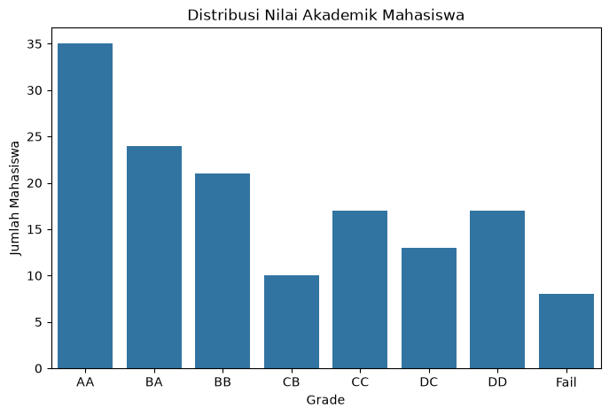
</p>

---

## Distribusi Jenis Kelamin

<p align="center">
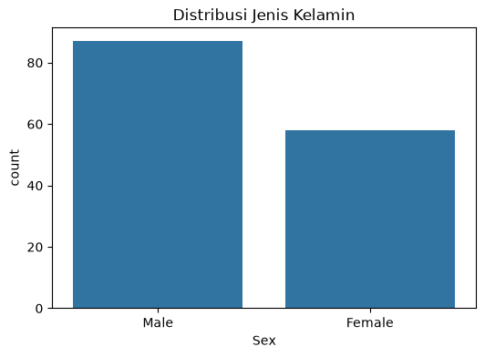
</p>

---

## Distribusi Jam Belajar Mingguan

<p align="center">
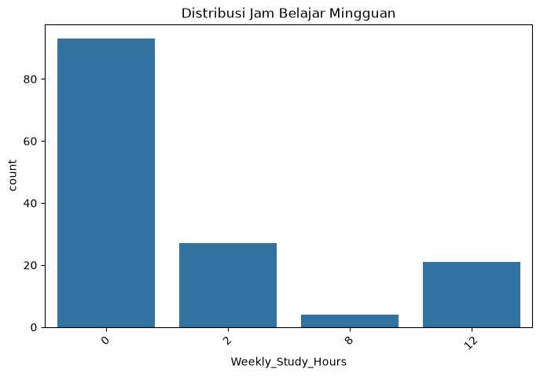
</p>

---

## Distribusi Kehadiran

<p align="center">
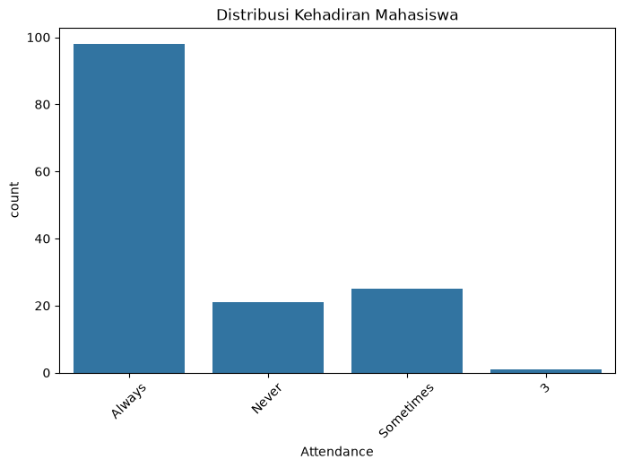
</p>

---

## Distribusi Aktivitas Membaca

<p align="center">
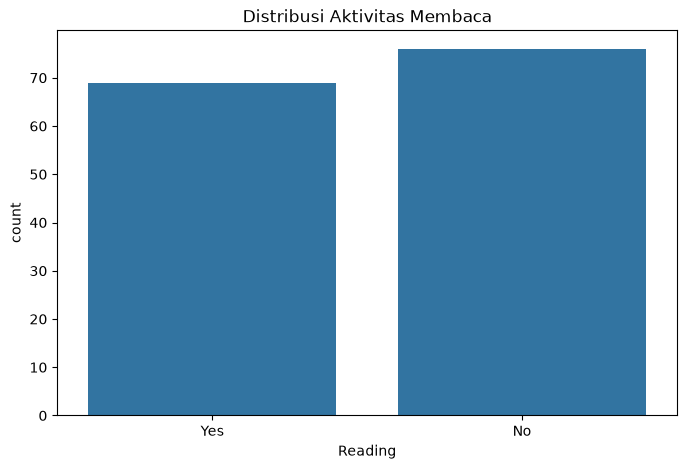
</p>

---

## Distribusi Kebiasaan Mencatat

<p align="center">
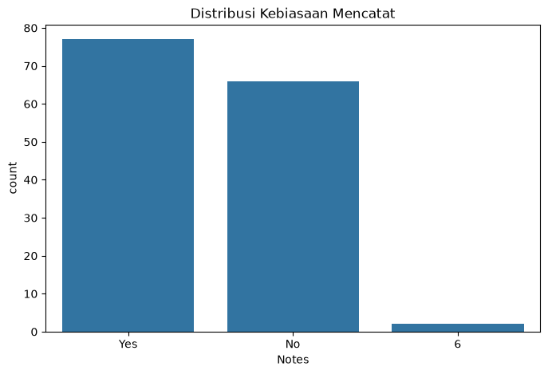
</p>

---

## Distribusi Tingkat Perhatian di Kelas

<p align="center">
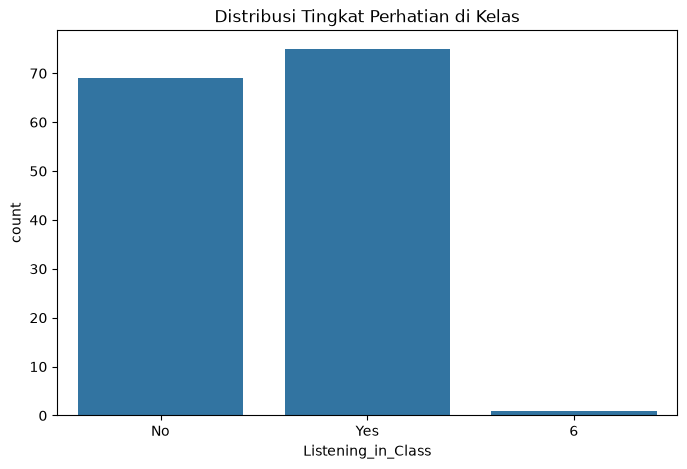
</p>

---

## Distribusi Partisipasi Project

<p align="center">
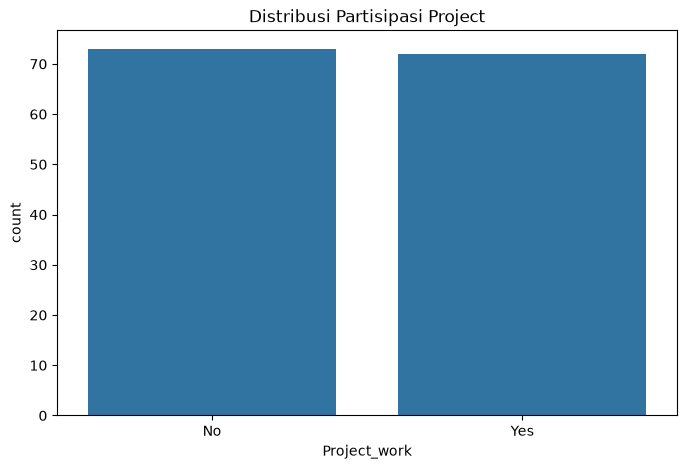
</p>

---

## Heatmap Korelasi

<p align="center">
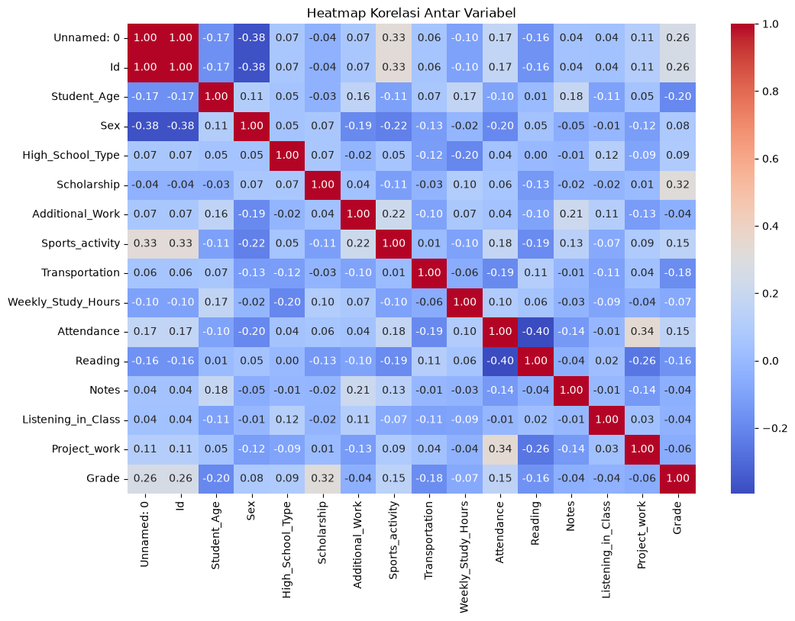
</p>

---

## Korelasi terhadap Grade

<p align="center">
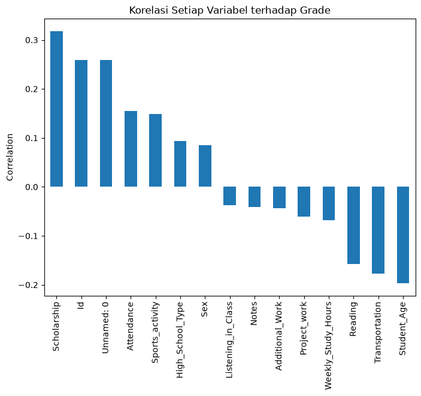
</p>

---

# ⚙️ Data Preparation

Tahapan Data Preparation meliputi:

- Penghapusan atribut yang tidak relevan
- Pemeriksaan Missing Value
- Pemeriksaan Data Duplikat
- Label Encoding
- Pemisahan Feature dan Target
- Train-Test Split (80% : 20%)

Normalisasi tidak dilakukan karena algoritma Decision Tree dan Random Forest tidak dipengaruhi oleh skala data.

---

# 🤖 Model Machine Learning

Model yang digunakan pada penelitian ini adalah:

## 🌳 Decision Tree

Kelebihan:

- Mudah dipahami
- Cepat dilatih
- Mudah divisualisasikan

Kekurangan:

- Rentan mengalami overfitting

---

## 🌲 Random Forest

Kelebihan:

- Mengurangi overfitting
- Lebih stabil
- Memiliki Feature Importance
- Generalisasi lebih baik

---

# 🌳 Visualisasi Model

## Decision Tree

<p align="center">
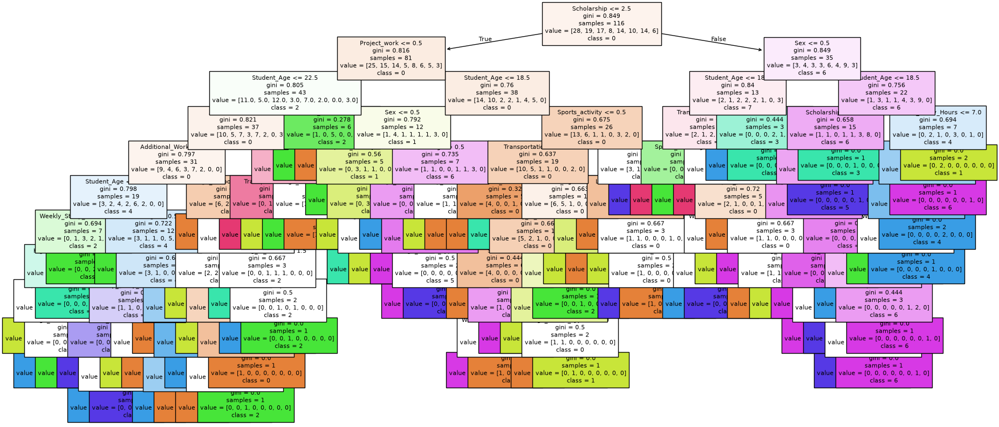
</p>

---

## Feature Importance Random Forest

<p align="center">
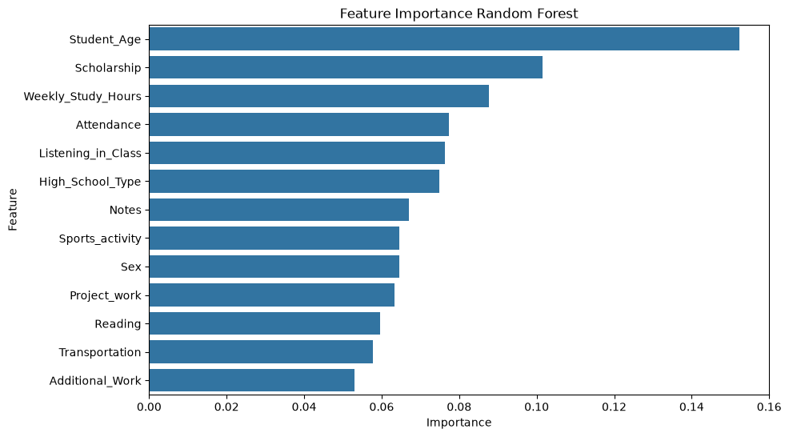
</p>

---

# 📊 Hasil Evaluasi

Evaluasi dilakukan menggunakan:

- Accuracy
- Precision
- Recall
- F1-Score
- Confusion Matrix

## Perbandingan Model

| Model | Accuracy | Precision | Recall | F1-Score |
|--------|---------:|----------:|-------:|---------:|
| Decision Tree | 0.1724 | 0.1422 | 0.1724 | 0.1540 |
| **Random Forest** | **0.2069** | **0.1954** | **0.2069** | **0.1879** |

---

## Confusion Matrix Decision Tree

<p align="center">
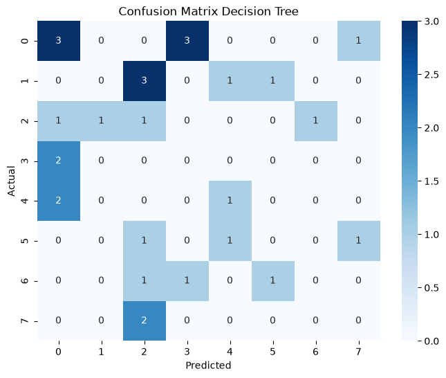
</p>

---

## Confusion Matrix Random Forest

<p align="center">
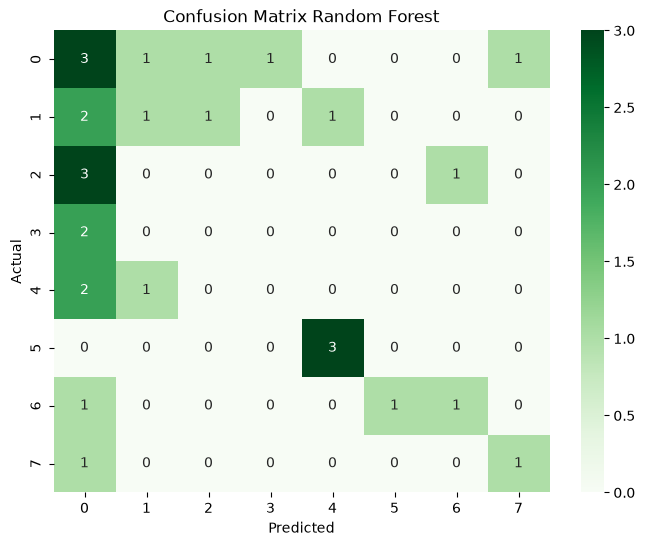
</p>

---

## Perbandingan Performa Model

<p align="center">
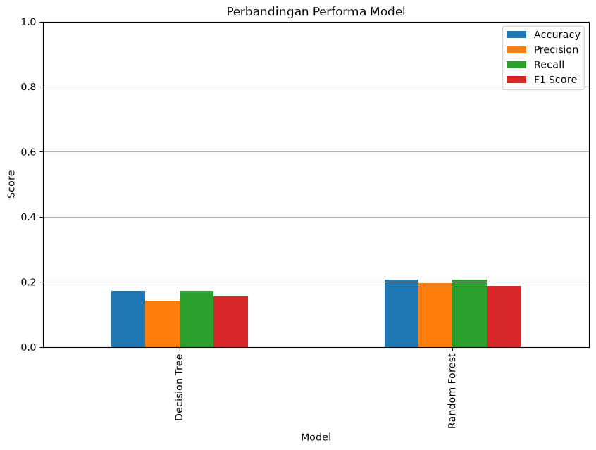
</p>

---

# 📌 Kesimpulan

Penelitian berhasil mengimplementasikan algoritma Decision Tree dan Random Forest untuk memprediksi nilai akademik mahasiswa berdasarkan karakteristik dan aktivitas belajar.

Berdasarkan hasil evaluasi, algoritma **Random Forest** memberikan performa terbaik dengan:

- **Accuracy:** 20.69%
- **Precision:** 19.54%
- **Recall:** 20.69%
- **F1-Score:** 18.79%

Meskipun performa model masih dapat ditingkatkan melalui penambahan jumlah data, Hyperparameter Tuning, dan Cross Validation, penelitian ini telah berhasil menunjukkan penerapan metodologi CRISP-DM dalam pengembangan model Machine Learning pada bidang pendidikan.

---

# 🛠️ Library yang Digunakan

- Python
- Pandas
- NumPy
- Matplotlib
- Seaborn
- Scikit-learn
- Pickle
- Jupyter Notebook

---

# 🚀 Cara Menjalankan Project

### 1. Clone Repository

```bash
git clone https://github.com/rssyiff/UAS_KECERDASAN_BUATAN_PREDIKSI_NILAI.git
```

### 2. Masuk ke Folder Project

```bash
cd UAS
```

### 3. Install Dependency

```bash
pip install -r requirements.txt
```

### 4. Jalankan Notebook

Buka file berikut menggunakan Jupyter Notebook atau Visual Studio Code.

```text
uas_model.ipynb
```

Kemudian jalankan seluruh sel secara berurutan.

---

# 👩‍🎓 Penyusun

**Nama:** As'syifa Ramdani

**NIM:** 2406011

**Program Studi:** Teknik Informatika

**Universitas:** Institut Teknologi Garut

---

# 📚 Referensi

- Student Performance Dataset (Kaggle)
- Scikit-learn Documentation
- Pandas Documentation
- Matplotlib Documentation
- Seaborn Documentation
- Referensi jurnal ilmiah yang tercantum pada laporan penelitian.

---

⭐ **Proyek ini dikembangkan sebagai tugas Ujian Akhir Semester (UAS) Mata Kuliah Kecerdasan Buatan dengan studi kasus prediksi nilai akademik mahasiswa menggunakan algoritma Decision Tree dan Random Forest.**